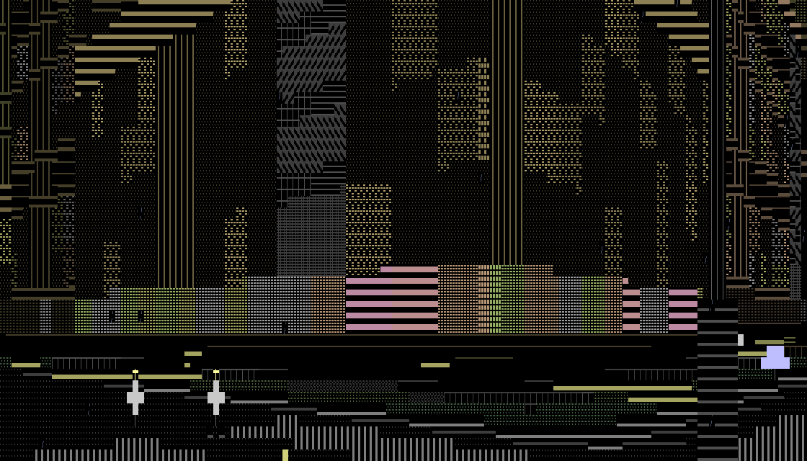
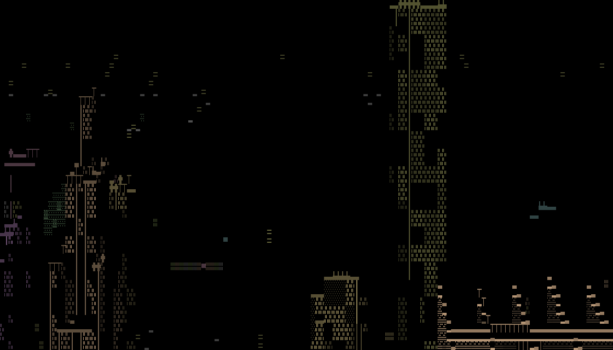
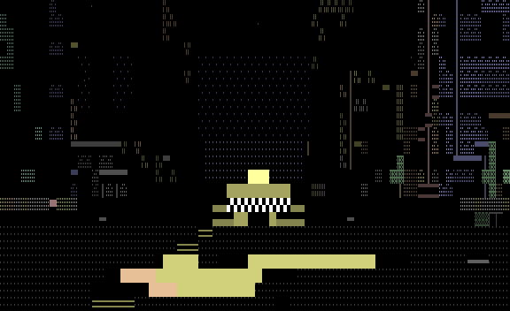
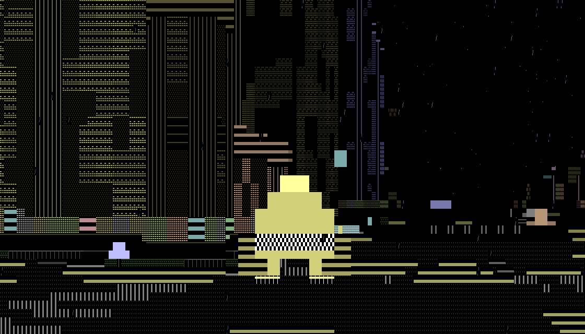

# ASCITTY — a raytraced ASCII city

A city built entirely out of typeable characters, rendered in real time, on a
colour terminal and on a **Commodore Plus/4**.



*Street level in block elements and colour, which is what you actually get —
`ascitty --shot 520 --size 140x40 --seed 99 --tour --walk`. Every shape in it
is one of 128 character cells this program generated with a function; there
is no artwork here and no font.*

The same renderer with `--mode ascii`, in 7-bit characters and no colour at
all:

```
""~""!..#...==========!...===...||||===\.....=====......!!!!.........====..======"=!!"~~====
!!.#!!.""==========!!!!...===...||\\\\\\.....=====......!!!!......==.====...======"!!="~~=/=
!!.#!"###======.==!!!!!...===...\\\\\\\\.....=====......!!!!......===..==...==.====!"=="~~=X
!!".!!###===....==!!!!!.........\\\\\\\=.....==========o!!!!......===.......==..===!!====~\.
!"..!!##...=....==!!!!!.........\\||====..........=====o!!!!===...===....==.==..===!!=="===.
!!..!!.....=....==!!!!!.........||||=///..........=====o!!!!======.==....==.....===!!===.=/.
!!##!!.....=..====!!!!!.........////////..........=====o!!!!======...YY..==...=.=""!!===.==~
!!##"""~~.....====!!!!!.........////////..........=====o!!!!======...YY...=...=.=~~""=====\=
!!"~!!~~~.....====!!!!!........./////===..........====..!!!!======...YY....=..=.=~~!!~"===/=
==~~!!~"".........!!!!!.........||||====...==...........!!!!...===...||....=..=.."""!~~~""/.
=="""!###.........!!!!!.........########=====...........!!!!.........||....=..=...=!!""~~~\.
.#..!!###.........!!!!!...===...########=====...........!!!!.........||....=..=...=!!=..""\.
.#..!!###...==....!!!!!...===...########=====...........!!!!.........==....=.....==!!=..==/.
#.#.!!..#...==....!!!!!...===...########=====...........!!!!.........==....=.....==!!==.===.
#.#.!!..#...==....!!!!!...===...########===#######HHHHH88HHHHHH......==....=.....==!!==.==#.
#."""H:::HHHHHHHHHHHHHHHHHHHHHHHHHHHHHHH##########HHHHH88HHHHHHHHHHHHHH##HHH###HH::::"""""#X
:::::H:::HHHHHHHHHHHHHHHHHHHHHHHHHHHHHHH##########HHHHH88HHHHHHHHHHHHHH##HHH###HH::::::::::X
~~~~~~~~~~HHHHHHHHHHHHHHHHHHHHHHHHHHHHHH##########HHHHH88HHHHHHHHHHHHHH##HHH###HH:~~~~~~~~~@
_+++++++++++++++++~~~~~~~~~~~~~~~~~~~~~~~~~~~~~~~~~~~~H88~~~~~~~~~~~~~~~~~~~~~++++++++++++++
.........----______++++++++++++++++++++++++~~~~~~~~~~~~~~~~~~~~++++++++++++++++++++++_____--
```

*`ascitty --shot 520 --tour --mode ascii --seed 99` — the mode the name is
about, and the one that runs anywhere a terminal runs.*

## What it is

A grid-based 3D city and a renderer that turns it into characters. Every
frame, rays are cast out from the camera across the city; each one walks the
grid front to back and works out what should be drawn, how big, and what is
hidden behind what. Nearby things are larger and brighter, distant ones fade
into the dark.

There are no 3D models, no textures and no shaders. There is also no
character *artwork*: the 128 shapes it draws with are generated by a
function, and on the Plus/4 they are installed as the machine's own
character set, so it draws shapes no PETSCII set contains.

Three ways to be in it. It starts in the second one:

- **Drive** — third person behind a taxi that tracks its nose through town
  and hangs the tail out at speed, with street furniture that goes over,
  traffic that keeps its lane and gives way, and a fare on the clock. The
  cab drives itself until you touch a key, and from that key on it is
  yours.
- **Walk** — first person, eye height, down the avenues.
- **Copter** — free flight above the roofline, looking down.



*The copter, from `--copter --haze 1 --rain 0`. How far down it looks is
worked out from how high it is, how far the haze lets it see and how many
rows the frame has, rather than being a fixed tilt — see
[docs/camera.md](docs/camera.md).*

And weather: rain that leans with your heading and brightens in front of lit
windows, a moon that stays put as you turn, stars fixed to the world, and
haze that eats distance.

## Downloads

Right-click → Save Link As. Either works on a real Plus/4; the `.prg` starts
faster, the `.d64` is what an SD2IEC or an emulator wants.

| File | Bytes | |
|---|---:|---|
| [ascitty.prg](https://github.com/vonglurt/ascitty/raw/main/build/ascitty.prg) | 26 840 | `DLOAD"ASCITTY"` then `RUN` |
| [ascitty.d64](https://github.com/vonglurt/ascitty/raw/main/build/ascitty.d64) | 174 848 | attach as drive 8, then the same |

Both are built by `make disk` from the sources here, and both have been
booted in VICE — the screenshot further down is one of them running.

## Build it

Two programs come out of this repository and they do not need the same
things. The terminal build needs a Rust toolchain and **nothing else** —
the workspace has no dependencies at all, so there is no lock file to
resolve and no crate to download. The Plus/4 build needs a 6502 C compiler,
and turning it into a disk image needs an emulator.

| | Needs | Get it with |
|---|---|---|
| The terminal build | Rust 1.70 or later | [rustup.rs](https://rustup.rs) |
| The Plus/4 build | cc65 | `brew install cc65` |
| The `.d64`, and running either in an emulator | VICE | `brew install vice` |

```sh
git clone git@github.com:vonglurt/ascitty.git
cd ascitty
make run                      # build the terminal version and play it
```

That is the whole of it for the terminal. `make run` builds in release,
which is where the renderer belongs: it is the program, and an unoptimised
build of a per-cell inner loop is about twenty times slower — the difference
between sixty frames a second and a slideshow. For the same reason the
*debug* profile in `Cargo.toml` is built at `opt-level = 2`, so a plain
`cargo run` is playable too; release is simply faster.

### Every target

```sh
make          # everything: the host build, the .prg and the .d64
make host     # the terminal build            -> target/release/ascitty
make prg      # the Plus/4 build              -> build/ascitty.prg
make disk     # ...on a disk image            -> build/ascitty.d64
make bake     # regenerate the baked tables   -> targets/plus4/gen/*.h

make run      # play it here
make demo     # watch the cab take fares on its own
make walk     # watch the camera walk instead
make run4     # play the Plus/4 build in xplus4
make demo4    # ...and leave it alone; it drives itself

make test     # 281 tests, about half a second
make check    # the gate: tests, both builds, and both actually rendering
make bench    # frames a second on this machine

make cast     # record the demonstration    -> build/tour.cast
make gif      # ...as an animated GIF       -> docs/media/demo.gif
make shot     # regenerate every picture in docs/media
make sheet    # print the glyph catalogue
```

`make check` is what has to pass. It runs the tests, builds both targets,
and then *renders* both — the host into a text frame and the Plus/4 build
into a screenshot from VICE — because a Plus/4 build that links and boots to
a blank screen is a build that compiles and does not work.

### The parts of the build worth knowing about

**The baked tables.** `make bake` runs the same Rust code the terminal
renderer uses and writes what it produced as C headers: the sine table, the
reciprocal table, the character set and the city itself. The Plus/4 does not
generate its own city — it could not do it in the time or the memory — so
the two targets are guaranteed to show the same one. Change the generator
and the headers are stale until `make bake` runs; `make prg` does it for
you.

**The seed is in the Makefile.** `SEED ?= 2780919582` is the city both
targets bake. Overriding it builds a Plus/4 program of a different city
from the one the terminal renders, which is occasionally what you want and
never what you want by accident.

If something does not work — wrong colours, wrong characters, a terminal
that will not report its size, cc65 not on the path — the fixes are in
**[INSTALL.md](INSTALL.md)**, and the toolchain setup in
[docs/dev-setup.md](docs/dev-setup.md).

## Run it

```sh
make run                     # or: ./target/release/ascitty
```

You arrive on the pavement beside a waiting cab, in it, with a fare already
on the clock — and the cab pulls away on its own. **Touch any key and you
are driving.** There is no menu and no mode to choose: the attract mode and
the game are the same program in the same mode, and the only difference
between them is whether your hands are on the keyboard. `\` hands it back
to the cabbie.

### Watch it drive itself



*Eight seconds of `make demo`, recorded by `make gif`. Small and short
because a GIF is a whole frame every frame; `make cast` records the same
thing as an asciinema file, which stays sharp at any size and is a tenth of
the bytes.*

```sh
make demo                    # the cab takes fares on its own
make walk                    # ...or the camera walks the streets instead
make cast                    # record it to build/tour.cast (asciinema)
make gif                     # ...or to docs/media/demo.gif
```

The cab picks up a fare, plans a route over the carriageway, drives the
right-hand lane to it and pulls up at the circle on the pavement — then does
it again. That is what `make run` does when you leave it alone, so `--demo`
only says out loud what is already the default; `--play` is the opposite,
and puts you at the wheel from the first frame. `--demo --walk` gives the
older walking tour, which reads the city rather than
following a baked path: it probes ahead, turns at junctions, keeps to the
middle of the street, and stops to look up at whatever is tallest nearby.
Touch any movement key and you take over; `\` hands it back.

The trick that makes it look like a person rather than a dolly is that
**heading and gaze are separate** — the feet go one way while the head turns
to watch a tower go past, and the walking never stops to let the look happen.
It is deterministic, so a recorded animation is reproducible.

[`docs/media/tour-strip.txt`](docs/media/tour-strip.txt) is the same walk
sampled every few seconds.



*The chase camera, from `make demo`. The cab's heading and the camera's are
not the same thing — the boom lags a turn by a few frames, so a slide is
watched from outside the spin.*

### Controls

Driving:

| | |
|---|---|
| `w` or `↑` | throttle |
| `s` or `↓` | brake, then reverse |
| `q` `a` or `←` | steer left |
| `e` `d` or `→` | steer right |
| `space` | handbrake |
| `t` | get out and walk |

**Hold them.** The throttle winds on while the key is down, and the engine
pulls hardest low down and tapers off as the speed comes up, so the top of
the range is about a second and three quarters away rather than a quarter of
one. `q` and `w` together is a left-hander taken under power, which is what
holding two keys at once is for.

The camera carries the driver's head, on a spring: get on the throttle and it
is left behind and you see sky, stand on the brakes and it is thrown forward
onto the road, and at any constant speed it sits still — a hundred and fifty
miles an hour down a straight looks like standing still, and the moment you
lift off is the moment you feel.

That last part wants a terminal that reports key *releases* — kitty,
ghostty, WezTerm and foot do, and the program asks yours at startup. Where
it is not on offer a press is held for half a second and topped up by the
terminal's own autorepeat, which is close but is not the same thing: a
terminal repeats the most recently pressed key only, so the earlier of two
held keys is a coast rather than a hold.

On foot and in the air:

| | |
|---|---|
| `w` `s` | forward, back |
| `q` `e` or `←` `→` | turn |
| `a` `d` | strafe sideways |
| `↑` `↓` | look up and down |
| `space` `z` | up, down |
| `t` | get in the cab |
| `c` | walk / copter |

Any time: `g` switches ASCII and block elements, `1`–`9` `0` set the rain,
`h` cycles the haze, `m` is the moon, `\` hands the camera back to the
autopilot, `esc` quits.

A terminal cannot see a bare Shift — it sends no bytes at all — so `z`
descends where you might expect Shift to.

### Options

```
--seed N          which city to generate
--mode ascii      7-bit ASCII only — the mode the name is about
--mode unicode    block elements (default)
--color true|16|none
--size WxH        override the terminal size
--rain 0..8   --haze 0..8   --stars 0..8   --no-moon
--drive  --copter  --walk
--demo, --tour    let the cab drive itself, taking fares  (the default)
--play            take the wheel from the first frame, with no autopilot
--walk            get out and walk; makes the demonstration a walking tour
--anim            play the demonstration and exit
--record FILE     write the demonstration to an asciinema .cast
--gif FILE        ...and/or as an animated GIF
--frames N        how long, for --anim, --record and --gif  (default 900)
--shot [N]        render N frames, print the last as plain text, exit
--png FILE        write that shot as a picture instead of printing it
--bench           200 frames as fast as possible, and report
```

`--shot` needs no terminal at all, which is what makes it usable from a
Makefile and from CI. Neither do `--png` and `--gif`: every picture in this
README was made by one of them, at 8x16 pixels a cell, with the renderer's
own glyphs and the Plus/4's own palette — so they are the output rather than
a photograph of it. Both encoders are written here, because the workspace
has no dependencies and adding one to write a file format would be a strange
place to start.

## What is in it

Everything below is generated from the seed and driven by the same rules,
which is the point of the list: it is one system, not a pile of features.
Nothing here is authored — there is no artwork, no scripted route, no
hand-placed building and no level.

### The shift

A run is a shift on the clock, and the clock is the whole of the pressure.

| | |
|---|---|
| Starting time | 60 s |
| A coin | +2 s, +$1 |
| Picking up, and setting down | +12 s each |
| The fare itself | $3 a cell of distance, plus $10 |
| Combo | consecutive things hit without touching a wall; a car pays `2 × combo`, a lamp post pays `combo` |

**Time comes only from working.** There is no other source — no pickups
lying about, no bonus for driving well. The only way to keep playing is to
keep taking fares, which is why the clock never has to be explained.

### What it says out loud

The status line shouts, in the arcade way. Each of these is an event the
simulation returns rather than a string it prints, so the front end decides
whether to shout and the core does not know there is a screen.

| | |
|---|---|
| `GO GO GO` | the passenger got in |
| `FARE PAID` | and got out again, somewhere else |
| `+2s` | a coin off the trail |
| `CRUNCH` | a lamp post, a hydrant, a parking meter — over it goes |
| `SMASH` | another car, hit hard enough to send it spinning |
| `OW` | a building, which does not move |
| `TIME UP` | the shift is over |

### The machines

| | Length | Mass | Drawn as |
|---|---:|---:|---|
| The cab | 12 m | 10 | `Taxi`, chequer band and roof sign, from any angle |
| Traffic | 9.6 m | 9 | `Car` end-on, `JeepSide` or `MuscleSide` in profile, `Wreck` once dented |
| A bus | 24 m | 40 | `Bus`, `BusSide` |
| People | — | — | `Ped`, on the pavements and the crossings |

Twelve vehicles and forty-eight people, and the same twelve and forty-eight
all shift: when one falls more than about forty cells behind it is picked up
and put back down somewhere ahead. A fixed-size pool rather than a streaming
world, because a fixed pool is the shape a 64 KB machine can also run.

They keep the right-hand lane, take their direction from the side of the
road they are on, ease off for whatever is in front of them, give way to
anything crossing from their right, and collide with each other as well as
with you. A bus does not care that you hit it.

### The street

| Class | Width | |
|---|---|---|
| `Alley` | 1 cell, 6 m | service access between buildings; no pavement, no paint |
| `Street` | 2 cells, 12 m | one lane each way |
| `Avenue` | 3 cells, 18 m | |
| `Boulevard` | 4–5 cells, 24–30 m | |
| `Arterial` | 12–16 cells, 72–96 m | one or two per city, running its whole length |

Ground is `Road`, `Sidewalk`, `Building`, `Park` or `Plaza`, and the
difference matters to everything: cars belong on the first, people on the
rest, fares wait on the pavement, and the walking network is a second map
over the same grid so that a pedestrian crosses at the crossing.

Standing on the pavement: `LampPost`, `Signal`, `Hydrant`, `Bollard` at the
kerb, `Tree` planted in the verge behind it, `Mailbox` and `Meter` on the
paving. All of it goes over when you hit it, at a velocity and a lean, and
none of it slows the car down — which is the whole appeal.

### The architecture

Six archetypes, each a rule about what a wall does rather than a model:

| | |
|---|---|
| `CurtainWall` | continuous glass grid, corner to corner, no expressed floors |
| `Slab` | full-height piers with window slots between them — the zipper |
| `Prewar` | brick, punched windows, a cornice, a fire escape on the street face |
| `Setback` | steps inward as it rises: the wedding cake |
| `Deco` | setback plus a crown, piers carrying past the top floor |
| `LowRise` | two or three storeys of shopfront |

...crossed with three uses — `Commercial`, `Residential`, `Civic` — which
decide the window pattern, the colour and how the lights come on at night.
A twelve-storey office and a twelve-storey block of flats share an archetype
and are not the same building.

### The weather, and the time of day

Rain 0–8, haze 0–8, stars 0–8 and a moon that can be switched off. It is
always night, because a night city is lit windows and a day city is a grey
box, and because the one colour trick this renderer has — hold the hue, drop
the luminance — is what distance looks like after dark.

### What the car does

| | |
|---|---|
| An engine with a curve | hardest from rest, tapering off; the top of the range is 1¾ s away, not ¼ |
| Grip that lets go at the top | 0.09 of slip through a corner at 100 km/h and 0.29 at 150 — a car through town and a boat at the top of it, with a handbrake for when you want the boat sooner |
| A corner that widens with speed | radius grows with the square of it, so getting round a junction means slowing down or hanging the tail out |
| **Acceleration bobbing** | the camera carries the driver's head on a spring: back under power, forward under braking, still at any constant speed |
| Damage that is only paint | it accumulates and it shows; the car never stops working |
| A chase boom that gets out of the way | shortened until it is clear of the wall it would otherwise show you the inside of |

The head is the one to watch for. It answers to *acceleration* and to
nothing else, so a hundred and fifty miles an hour down a straight looks
exactly like standing still, and the moment you lift off is the moment you
feel — three rows of horizon under power, four under braking, and a bob past
level and back when the throttle comes off.

### The rules underneath

The features above are consequences of six decisions, and the decisions are
the actual design.

**Nothing is drawn.** Not the city, not the font, not the cars. The 128
shapes the renderer draws with come out of a function, and on the Plus/4 the
same function's output is installed as the machine's own character set.

**One rule for everybody.** The autopilot and your hands hand the car the
same three controls, and nothing downstream can tell which is which. The cab
and the traffic take which half of the road is theirs from the same module —
and that module's two halves, *which way does this lane go* and *where
should a car going this way be*, are tested against each other on every
carriageway cell of four cities, because the whole benefit is that the thing
which places cars and the thing which steers them cannot disagree.

**Time comes only from working**, so pace is the only strategy.

**Nothing ends the run but the clock.** No fuel, no damage model, no fail
state that is about the vehicle instead of about you.

**The measurement decides.** Every figure in this README and in `docs/` was
measured by a test that is still in the tree, and several of them are
recorded as *worse* than what they replaced until somebody worked out why.

**It has to fit in 64 KB.** Fixed point end to end, fixed-size pools, no
allocation per frame, and no dependencies at all — the crate list is the
three crates in this repository and nothing else. The Plus/4 is not a port;
it is the constraint the whole thing is designed against.

## On a Commodore Plus/4


`build/ascitty.prg` and `build/ascitty.d64` are the real thing: a 40×25
city, in colour, on a 1.76 MHz 7501, with a character set generated on a
laptop and baked into the program.

```sh
make disk
make run4        # boots it in xplus4
make demo4       # boots it and leaves it alone - it drives itself
```

`demo4` is the attract mode: the program walks the streets on its own from
boot and stops the moment you touch a key.

It runs at about **1.3 frames a second** — measured, not estimated; the
method is in [docs/plus4.md](docs/plus4.md). The next factor of three is a
hand-written assembly inner loop, and it is at the top of
[the backlog](docs/backlog.md).

## How it works

The whole thing is one renderer with two front ends:

```
                    ┌──────────────────┐
                    │   ascitty-core   │   Rust, zero dependencies
                    │ no I/O, no clock │   fixed point throughout
                    └────────┬─────────┘
                   ┌─────────┴──────────┐
                   ▼                    ▼
          ┌────────────────┐   ┌──────────────────┐
          │  ascitty-tty   │   │  ascitty-bake    │
          │ a colour       │   │ writes C headers │
          │ terminal       │   └────────┬─────────┘
          └────────────────┘            ▼
                              ┌──────────────────┐
                              │ targets/plus4    │  C, via cc65
                              │ .prg  and  .d64  │
                              └──────────────────┘
```

Four ideas do most of the work.

### It does not stop at the first hit

Casting one ray per column and taking the first thing it hits is enough for
a maze. It is not enough for a skyline, because what makes a city look like a
city is a **tall building seen over the top of a near one**. So each column
keeps walking, carrying one number — the topmost row anything has claimed —
and each further building may only draw above that line. When the line
reaches the top of the screen, the column is done.

### The world is a height field

Every cell carries one height; a building is a run of cells sharing a lot.
That makes the walk cheap, and it makes **setbacks free**: a tower that steps
in as it rises is just a lot whose edge cells are shorter than its middle.
The wedding-cake silhouette of a 1920s tower is four lines of code.

On top of it sit three more layers, each its own structure because the
questions are different: a **street plan**, a **zoning map**, and a
**pedestrian network**. The streets are generated rather than computed —
five road classes from a one-cell alley to a sixteen-cell arterial, at
irregular spacing, with bigger roads getting bigger blocks after them so the
hierarchy is visible from the ground. The zoning says what ground is *for*,
which is a different question from what is built on it: a twelve-storey
residential slab and a twelve-storey office slab are built the same way and
are different buildings. And the walking network is not the driving one —
conflating them is what used to put pedestrians in the middle of the avenue.

### The font is generated, not drawn

A glyph is an 8×8 bitmap produced by a *function* — a dither level, a
quadrant mask, a half-plane, a window bay — and the catalogue is that
function evaluated over its parameters. 128 of them, which is exactly a TED
character set in RAM.

The renderer emits catalogue *indices*. On the Plus/4 the index is the screen
code and the colour byte is already the hardware byte, so the machine does no
conversion at all. On a terminal, an index becomes either a printable ASCII
character or a Unicode block element.

The four facade textures are chosen **per building, from the lot's seed** —
one tower is drawn in `X`, its neighbour in `0`, a third in `8`. Whether a
given window is lit is decided separately, at the resolution the screen cell
can actually resolve. Getting those two rates the wrong way round was the
first thing that looked wrong: a skyline becomes one textured mass instead of
a row of buildings.

### Lighting is five numbers, and shadows are one sweep

A height field of axis-aligned cells presents exactly **five normals** — four
walls and a roof — and the renderer already knows which one it hit. So for a
directional light, `L·N` is five numbers recomputed once per frame, not a dot
product per fragment.

Cast shadows need no shadow rays either. Sweep the grid once in the direction
the light travels, carrying a running horizon; a surface is dark below the
line and lit above it. **O(cells) once per light, O(1) per lookup.** The
Plus/4 does not even sweep — the line is a pure function of the heights and
the bearing, so it is baked into the program.

Both were measured free. [docs/raytracing.md](docs/raytracing.md) sets the
classical formulas against what this renderer actually computes and costs out
what else an ASCII city can afford.

### Colour is the Plus/4's, and depth is a subtraction

The TED gives 16 hues at 8 luminances. **Hold the hue, drop the luminance**:
a blue tower stays blue as it recedes and simply gets darker. That is what a
night city does, and it costs one subtraction rather than a colour-space
interpolation. The terminal emulates the TED's palette, not the other way
round.

## The architecture in one paragraph

`ascitty-core` owns the number system, the city, the camera, the glyphs, the
cast, the physics and the weather, and touches no terminal, no file and no
clock. `ascitty-bake` runs that same code and writes what it produced —
character set, sine table, reciprocals, a 64×64 district — into C headers, so
the 6502 build has no second copy of anything and cannot disagree with the
host about what a building looks like. Nothing in `targets/plus4/gen` is
committed, because the generator is the definition.

## Documentation

Everything is indexed at **[docs/index.md](docs/index.md)**.

| | |
|---|---|
| [lab-report.md](docs/lab-report.md) | the design and measurement record, in IEEE form |
| [architecture.md](docs/architecture.md) | how the whole thing fits together |
| [camera.md](docs/camera.md) | the three modes, the autopilot, recording |
| [renderer.md](docs/renderer.md) | the height-field walk, in detail |
| [raytracing.md](docs/raytracing.md) | the formulas, what we compute, and what an ASCII city can afford |
| [glyphs.md](docs/glyphs.md) | the procedural block font and the dithering |
| [city.md](docs/city.md) | streets, lots, archetypes, fire escapes |
| [driving.md](docs/driving.md) | the arcade physics, the traffic, and where a fare stands |
| [plus4.md](docs/plus4.md) | the 6502 build, and what it cost |
| [dev-setup.md](docs/dev-setup.md) | brew, rust, cc65, VICE |
| [backlog.md](docs/backlog.md) | what is coming, and why |
| [adr/](docs/adr/) | the decisions worth not re-litigating |

## Where it stands

Working: the renderer, all three cameras, the city generator with six
building archetypes, the procedural font, the weather, the driving physics,
the fare loop, the terminal front end and the Plus/4 build. 281 tests.

Not yet: sub-cell rooflines, proper roof surfaces, scoring and grades,
sprites and driving on the Plus/4, and the assembly inner loop that would
make the last of those possible. All of it is in
[the backlog](docs/backlog.md) with the reasoning kept.

## Credit

The idea comes from a prototype by someone who built a living ASCII city as a
single HTML file with a custom JavaScript engine — a grid-based 3D world, a
per-column raycaster, and letters and symbols instead of pixels. This is that
idea taken somewhere specific: fixed point, a generated font, and a machine
from 1984.

## Licence

MIT — see [LICENSE](LICENSE). © 2026 Paul Richeson and Claude.
