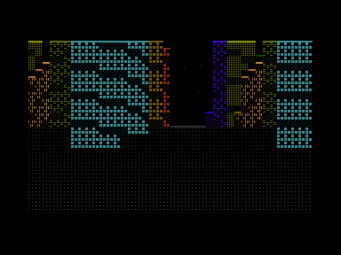

# ASCITTY — a raytraced ASCII city

A city built entirely out of typeable characters, rendered in real time, on a
colour terminal and on a **Commodore Plus/4**.

```
.M...          __             =====nn        ____                     .xxxxxxxXXX!!.......\\
.M...         !.M.  mm!_      ..m!mm.      !!!!!!!          ' .        xxxxxxxXXX!!.......//
.M...        .!.MM  mm!m.     .~~!~m.      !!!!!!!            ___      xxxxxxxXXX!!.......|\
MM...        .!.MM  .m!m      ...!...__ .  !!!!!!!`       . =.!W.      x..xxxxXXX!!~~~~~~~||
MM...        M!.MM  mm!m      .~~!~_____   !!!!!!!          WW!W.      xxx..==XXX!!~~:::../|
M__MM        M!MMM .mm!m      mm.!!M!.!M   !!!!!===       .!!!!!W    =======..XXX!!:::::..\\
M!.!!!!.._.  M!MMM  mm!m      m~~!!M!.!.. ====/!+..!+==   .!!!!!W! =///!......XXX!!:::::..//
M_______.!   M!...  mm!m   .' mm.!!M!.!=.M!X.\\!+++!.+.   .!!!!!.! .\\\!+.....XXX!!:::::..\\
MMMMMM!!MM.  M!...  mm!m      m~~!!M!.!..M!..|=!~~~!.+.   M!!!!!!! +///!+.....XXX!!~~~~~~~||
.MMMMM!!MM.  M%%..' mm!=..!MM=..m!!M!.!~~~!~.//!++.!++.=====!!!!!! ~\\\!~~~~~~XXX!!:::::..||
.MMMMM!!MM.. %%%%.  mm!!MM!.....==!.!M!..M!X+|=!+.+!+++!....!!!!!! .///!......XXX!!:::::..\\
MMMMMM!!MMM!%%%%%% 'mm!!M~!%%/...W!.!=W..M!X~\\!~~~!~~~!....!!!!M! .\\\!......XXX!%%::::..//
==%MMM!!MMM=%%%%%%` mm!!M.=%%/...~%%!\~~MM!X./=!++.!.+.!....!!!!M!=.///!......XXX!%%::~~~~\\
.%%M..!!MMM!.%%%%.  mm.!~~%%%%.m.%%%%\.MMM!X.//!++.!+.+!....!!!!.!=~\\\!~~~~~~XXX%%%%~~~~~||
.!%M..!!MMM!.W||..  m..!..!%%/.m..%%!\~~~~!~~\\!~~~!~~~==~~~!!!!M!W.///!......XXX!%%......||
.!..MM!!..M!...!.. =m..!MM!mm/m.W.!M!=.MM.!X.|=!+++!+++.!MMM!!!!M!n+###!......XXX!!:::::..##
MM#MMMMMM#MMMM__MM@MMMMMMMMMMMMMMMMMM###MM##XXXX#XX#XXXXMMMM##MMMMMXXXXXXXXXXXXXXXXXXXXX##XX
...||....--__++++++++""""""""""""""""""""""""""""""w""""""""""""""""""""""""""""""""w"wwwwww
...---..............--____++++++++++++++"""""""""""""""""""www""ww"""w""""wwwww"""""""""""""
..........------....................---______+++++++++++++++++++++""""""""""""""""""""""""""
```

*Street level, 7-bit ASCII, no colour — `ascitty --shot 450 --tour --mode ascii --seed 99`.
The same frame in block elements and colour is what you actually get.*

## What it is

A grid-based 3D city and a renderer that turns it into characters. Every
frame, rays are cast out from the camera across the city; each one walks the
grid front to back and works out what should be drawn, how big, and what is
hidden behind what. Nearby things are larger and brighter, distant ones fade
into the dark.

There are no 3D models, no textures and no shaders. There is also no
character *artwork*: the 128 shapes it draws with are generated by a
function, and on the Plus/4 they are installed as the machine's own
character set, so it draws shapes no PETSCII set contains.

Three ways to be in it:

- **Walk** — first person, eye height, down the avenues.
- **Drive** — third person behind a taxi, with arcade physics that slide,
  street furniture that goes over, traffic that scatters, and a fare on the
  clock.
- **Copter** — free flight above the roofline, looking down.

And weather: rain that leans with your heading and brightens in front of lit
windows, a moon that stays put as you turn, stars fixed to the world, and
haze that eats distance.

## Downloads

Right-click → Save Link As. Either works on a real Plus/4; the `.prg` starts
faster, the `.d64` is what an SD2IEC or an emulator wants.

| File | Bytes | |
|---|---:|---|
| [ascitty.prg](https://github.com/vonglurt/ascitty/raw/main/build/ascitty.prg) | 19 524 | `DLOAD"ASCITTY"` then `RUN` |
| [ascitty.d64](https://github.com/vonglurt/ascitty/raw/main/build/ascitty.d64) | 174 848 | attach as drive 8, then the same |

Both are built by `make disk` from the sources here, and both have been
booted in VICE — the screenshot further down is one of them running.

## Run it

```sh
brew install cc65 vice        # only needed for the Plus/4 build
git clone git@github.com:vonglurt/ascitty.git
cd ascitty
make run
```

Full instructions, including the Plus/4, are in
**[INSTALL.md](INSTALL.md)**.

### Watch it walk itself

```sh
make demo                    # the camera walks the streets and looks around
make cast                    # record it to build/tour.cast (asciinema)
```

`--tour` hands the camera to a walker that reads the city rather than
following a baked path: it probes ahead, turns at junctions, keeps to the
middle of the street, and stops to look up at whatever is tallest nearby.
Touch any movement key and you take over; `\` hands it back.

The trick that makes it look like a person rather than a dolly is that
**heading and gaze are separate** — the feet go one way while the head turns
to watch a tower go past, and the walking never stops to let the look happen.
It is deterministic, so a recorded animation is reproducible.

[`docs/media/tour-strip.txt`](docs/media/tour-strip.txt) is the same walk
sampled every few seconds.

### Controls

| | |
|---|---|
| `w` `s` | forward, back — throttle and brake when driving |
| `a` `d` | turn — steer when driving |
| `q` `e` | strafe |
| `space` | handbrake |
| `arrows` | turn and look |
| `r` `f` | rise, descend (copter) |
| `c` | switch walk / drive / copter |
| `t` | switch ASCII / block elements |
| `1`–`9` `0` | rain, from torrential to dry |
| `h` | cycle the haze |
| `m` | moon on and off |
| `\` | hand the camera back to the autopilot |
| `esc` | quit |

### Options

```
--seed N          which city to generate
--mode ascii      7-bit ASCII only — the mode the name is about
--mode unicode    block elements (default)
--color true|16|none
--size WxH        override the terminal size
--rain 0..8   --haze 0..8   --stars 0..8   --no-moon
--drive  --copter
--tour            let the camera walk itself
--anim            play the tour and exit
--record FILE     write the tour to an asciinema .cast
--frames N        how long, for --anim and --record   (default 900)
--shot [N]        render N frames, print the last as plain text, exit
--bench           200 frames as fast as possible, and report
```

`--shot` needs no terminal at all, which is what makes it usable from a
Makefile and from CI.

## On a Commodore Plus/4



`build/ascitty.prg` and `build/ascitty.d64` are the real thing: a 40×25
city, in colour, on a 1.76 MHz 7501, with a character set generated on a
laptop and baked into the program.

```sh
make disk
make run4        # boots it in xplus4
```

It runs at about **1.3 frames a second** — measured, not estimated; the
method is in [docs/plus4.md](docs/plus4.md). The next factor of three is a
hand-written assembly inner loop, and it is at the top of
[the backlog](docs/backlog.md).

## How it works

The whole thing is one renderer with two front ends:

```
                    ┌──────────────────┐
                    │   ascitty-core   │   Rust, zero dependencies
                    │ no I/O, no clock │   fixed point throughout
                    └────────┬─────────┘
                   ┌─────────┴──────────┐
                   ▼                    ▼
          ┌────────────────┐   ┌──────────────────┐
          │  ascitty-tty   │   │  ascitty-bake    │
          │ a colour       │   │ writes C headers │
          │ terminal       │   └────────┬─────────┘
          └────────────────┘            ▼
                              ┌──────────────────┐
                              │ targets/plus4    │  C, via cc65
                              │ .prg  and  .d64  │
                              └──────────────────┘
```

Four ideas do most of the work.

### It does not stop at the first hit

Casting one ray per column and taking the first thing it hits is enough for
a maze. It is not enough for a skyline, because what makes a city look like a
city is a **tall building seen over the top of a near one**. So each column
keeps walking, carrying one number — the topmost row anything has claimed —
and each further building may only draw above that line. When the line
reaches the top of the screen, the column is done.

### The world is a height field

Every cell carries one height; a building is a run of cells sharing a lot.
That makes the walk cheap, and it makes **setbacks free**: a tower that steps
in as it rises is just a lot whose edge cells are shorter than its middle.
The wedding-cake silhouette of a 1920s tower is four lines of code.

The street system on top of it is *generated*, not computed. Roads come in
four classes — alley, street, avenue, boulevard — at varying widths and
irregular spacing, with bigger roads getting bigger blocks after them, so the
hierarchy is visible from the ground. Building heights are drawn from a
skewed distribution rather than a uniform one, because uniform heights read
as noise: there is no general roofline for anything to stand above. Colour
comes from a district palette that drifts across the map, so a
neighbourhood has a colour instead of the city having confetti.

### The font is generated, not drawn

A glyph is an 8×8 bitmap produced by a *function* — a dither level, a
quadrant mask, a half-plane, a window bay — and the catalogue is that
function evaluated over its parameters. 128 of them, which is exactly a TED
character set in RAM.

The renderer emits catalogue *indices*. On the Plus/4 the index is the screen
code and the colour byte is already the hardware byte, so the machine does no
conversion at all. On a terminal, an index becomes either a printable ASCII
character or a Unicode block element.

The four facade textures are chosen **per building, from the lot's seed** —
one tower is drawn in `X`, its neighbour in `0`, a third in `8`. Whether a
given window is lit is decided separately, at the resolution the screen cell
can actually resolve. Getting those two rates the wrong way round was the
first thing that looked wrong: a skyline becomes one textured mass instead of
a row of buildings.

### Colour is the Plus/4's, and depth is a subtraction

The TED gives 16 hues at 8 luminances. **Hold the hue, drop the luminance**:
a blue tower stays blue as it recedes and simply gets darker. That is what a
night city does, and it costs one subtraction rather than a colour-space
interpolation. The terminal emulates the TED's palette, not the other way
round.

## The architecture in one paragraph

`ascitty-core` owns the number system, the city, the camera, the glyphs, the
cast, the physics and the weather, and touches no terminal, no file and no
clock. `ascitty-bake` runs that same code and writes what it produced —
character set, sine table, reciprocals, a 64×64 district — into C headers, so
the 6502 build has no second copy of anything and cannot disagree with the
host about what a building looks like. Nothing in `targets/plus4/gen` is
committed, because the generator is the definition.

## Documentation

Everything is indexed at **[docs/index.md](docs/index.md)**.

| | |
|---|---|
| [architecture.md](docs/architecture.md) | how the whole thing fits together |
| [camera.md](docs/camera.md) | the three modes, the autopilot, recording |
| [renderer.md](docs/renderer.md) | the height-field walk, in detail |
| [glyphs.md](docs/glyphs.md) | the procedural block font and the dithering |
| [city.md](docs/city.md) | streets, lots, archetypes, fire escapes |
| [driving.md](docs/driving.md) | the arcade physics |
| [plus4.md](docs/plus4.md) | the 6502 build, and what it cost |
| [dev-setup.md](docs/dev-setup.md) | brew, rust, cc65, VICE |
| [backlog.md](docs/backlog.md) | what is coming, and why |
| [adr/](docs/adr/) | the decisions worth not re-litigating |

## Building

```sh
make          # everything
make host     # the terminal build
make prg      # the Plus/4 build
make disk     # ...on a .d64
make test     # 131 tests, about a tenth of a second
make check    # the gate: tests, both builds, and both actually rendering
make bench    # frames per second here
make demo     # watch it walk itself
make cast     # record the walk as an asciinema file
make sheet    # print the glyph catalogue
make shot     # regenerate docs/media
```

## Where it stands

Working: the renderer, all three cameras, the city generator with six
building archetypes, the procedural font, the weather, the driving physics,
the fare loop, the terminal front end and the Plus/4 build. 131 tests.

Not yet: sub-cell rooflines, proper roof surfaces, scoring and grades,
sprites and driving on the Plus/4, and the assembly inner loop that would
make the last of those possible. All of it is in
[the backlog](docs/backlog.md) with the reasoning kept.

## Credit

The idea comes from a prototype by someone who built a living ASCII city as a
single HTML file with a custom JavaScript engine — a grid-based 3D world, a
per-column raycaster, and letters and symbols instead of pixels. This is that
idea taken somewhere specific: fixed point, a generated font, and a machine
from 1984.

## Licence

MIT — see [LICENSE](LICENSE). © 2026 Paul Richeson and Claude.
